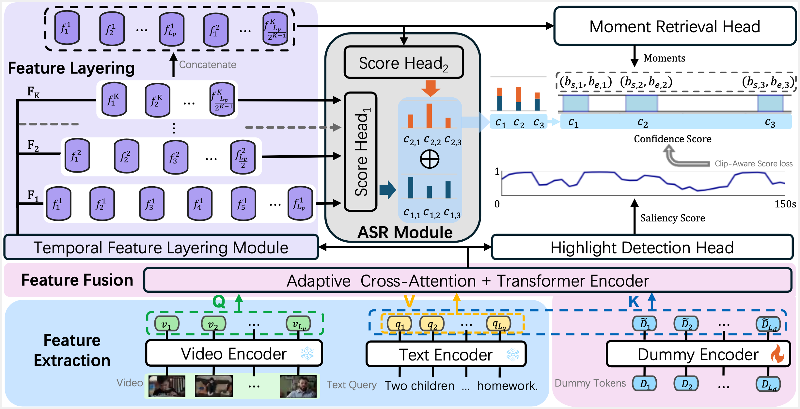

# FlashVTG: Feature Layering and Adaptive Score Handling Network for Video Temporal Grounding

This repository is the official implementation of the paper **FlashVTG: Feature Layering and Adaptive Score Handling Network for Video Temporal Grounding**. (WACV 2025)

> Zhuo Cao, Bingqing Zhang, Heming Du, Xin Yu, Xue Li, Sen Wang
>
> The University of Queensland, Australia

[**Preparation**](#-Preparation) | [**Training**](#-training) | [**Inference and Evaluation**](#-Inference-and-Evaluation) | [**Model Zoo**](#-model-zoo)

<p align="center"></p>

## 🔨 Preparation

1. Set up the environment for running the experiments.

   - Clone this repository.

     ```bash
     git clone https://github.com/Zhuo-Cao/FlashVTG.git
     ```

   - Download the packages we used for training. Python version 3.12.2 is required for reproduce.

     `pip install -r requirements.txt`

2. Download datasets

   Download QVHighlights and other datasets, please follow the instruction of [CGDETR](https://github.com/wjun0830/CGDETR/).

   For feature extracted by InternVideo2, you can download from [Hugging Face](https://huggingface.co/datasets/cg1177/qvhighlight_internvideo2_videoclip_6b_w2s).

## 🏋️ Training

We provide training scripts for all datasets in `FlashVTG/scripts/` directory.

### QVHighlights

For Internvideo2 feature:

```bash
bash FlashVTG/scripts/qv_internvideo2/train.sh
```

For SlowFast+CLIP feature:

```bash
bash FlashVTG/scripts/train_qv_slowclip.sh
```

### Charades-STA

For Internvideo2 feature:

```shell
bash FlashVTG/scripts/charades_sta_internvideo2/train.sh
```

For VGG feature:

```shell
bash FlashVTG/scripts/charades_sta/train_vgg.sh
```

### TACos

```shell
bash FlashVTG/scripts/tacos/train.sh
```

### TVSum

```shell
bash FlashVTG/scripts/tvsum/train.sh
```

### Youtube-hl

```shell
bash FlashVTG/scripts/youtube_uni/train.sh
```

## 🏆 Inference and Evaluation

Using ``inference.sh`` to do inference. Hint: ``data/MR.py`` for Moment Retrieval task and ``data/HD.py`` for Highlight Detection task. Here is a sample shows how to use ``inference.sh``.

```shell
bash FlashVTG/scripts/inference.sh data/MR.py results/QVHihlights_IV2/model_best.ckpt 'val'
```

For QVHighlights test set, you could do the evaluation on [codalab](https://codalab.lisn.upsaclay.fr/competitions/6937). For more details, check [standalone_eval/README.md]().

## 📦 Model Zoo

We provide multiple checkpoints and training logs here. Configuration can be find in each ``opt.json`` file.

| Dataset                        | Model file                                                   |
| :----------------------------- | ------------------------------------------------------------ |
| QVHighlights (Slowfast + CLIP) | [checkpoint and trainng log](https://www.dropbox.com/scl/fo/5p45sbdyw66dyd7uerqlu/ADa-udzNY7qINE72gU17ktQ?rlkey=x9vtaf6vseenja6yz4h9faycb&st=emtgjqyb&dl=0) |
| QVHighlights (InternVideo2)    | [checkpoint and trainng log](https://www.dropbox.com/scl/fo/19ayu7qtfyo5k4qc1rlz8/ALSHdXX4bKfq8Jwet36zQQY?rlkey=xwqb2tdxjzpq2ydx3qof30484&st=ahdmmatn&dl=0) |
| Charades (InternVideo2)        | [checkpoint and trainng log](https://www.dropbox.com/scl/fo/vxzx7o6221w35wx58655k/AN0tWBPRsvW9akunEYFSO0U?rlkey=8yt1guzfqqybiim4l5nfw4siy&st=xsp6juc9&dl=0) |
| Charades (VGG)                 | [checkpoint and trainng log](https://www.dropbox.com/scl/fo/2z5o51f4fmirduzdz6jw6/AEOjqAtcKdYgBKZDuIfqzjw?rlkey=7xyai6h0ct5npcr4jwja4vjkc&st=25wjllzd&dl=0) |
| TACoS                          | [checkpoint and trainng log](https://www.dropbox.com/scl/fo/ul45aq5zkgzzb8k9wh70p/AL1rSpma3xwkhyHvMvWjFkc?rlkey=4ed8t64t7tdg3wssveoosvr82&st=xpmp5r9a&dl=0) |


# Acknowledgements

This work is supported by Australian Research Council (ARC) Discovery Project DP230101753 and the code is based on [CGDETR](https://github.com/wjun0830/CGDETR/).